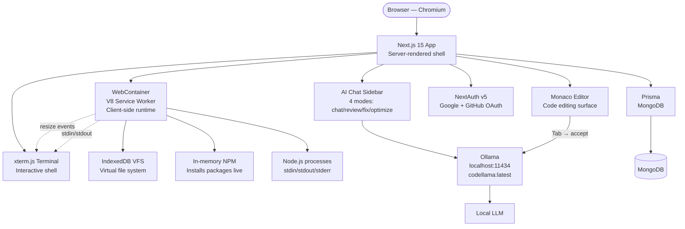
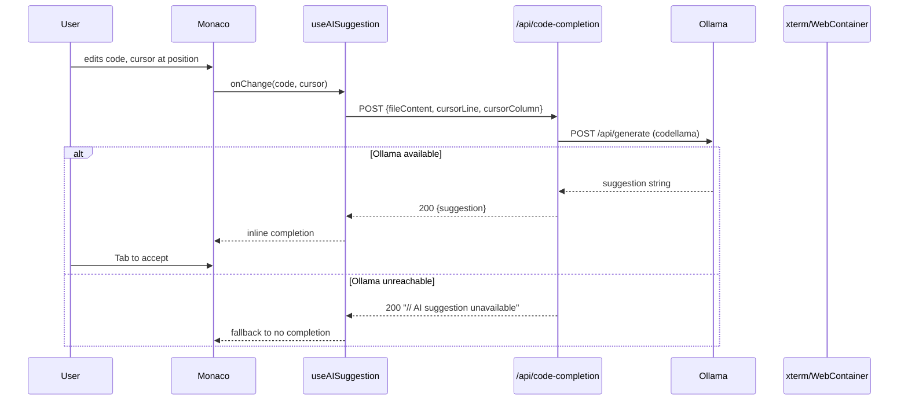

# Architecture — Codecraft AI

## Component diagram

## Sequence diagram — code completion flow

## Module descriptions

### `app/` — Next.js App Router
Request handlers for API routes and page rendering. Key routes:
- `app/api/chat/route.ts` — 4-mode AI chat, calls Ollama with mode in prompt
- `app/api/code-completion/route.ts` — receives cursor position + file content, returns AI suggestion or fallback
- `app/api/health/route.ts` — basic health check endpoint
- `app/(root)/page.tsx` — landing page (unauthenticated)
- `app/playground/[id]/page.tsx` — project editor (authenticated)

### `modules/webcontainers/` — WebContainer integration
- `hooks/useWebContainer.ts` — boots WebContainer, mounts template files, exposes instance via ref. Handles boot errors gracefully.
- `components/terminal.tsx` (510 lines) — xterm.js terminal with command history, resize handling, copy/download. Connects to WebContainer shell via `currentProcess` ref.
- `components/webcontainer-preview.tsx` — iframe preview pane for rendered output

### `modules/playground/` — Editor surface
- `components/playground-editor.tsx` — Monaco editor wired to `useFileExplorer` and `useAISuggestion`. Tab to accept AI suggestion, Escape to dismiss.
- `hooks/useAISuggestion.ts` — debounced code change → POST `/api/code-completion` → returns inline suggestion. Polls at 1s debounce.
- `hooks/useFileExplorer.ts` — Zustand store for open files, active file, template data
- `hooks/usePlayground.ts` — fetches playground by ID, sets template data, parses template files

### `modules/ai-chat/` — Chat sidebar
4-mode AI assistant: chat (freeform), review (code review), fix (debug), optimize (performance). Routes through `app/api/chat/route.ts` → Ollama.

### `modules/dashboard/` — Project management
Create/edit/delete/list/star projects. Backed by Prisma + MongoDB. Zustand store in `useFileExplorer` drives the project list.

### `lib/` — Shared utilities
- `db.ts` — Prisma client singleton
- `ratelimit.ts` — per-IP sliding window rate limiter (20 req/min)
- `env-validate.ts` — startup validation of required env vars
- `utils.ts` — cn() helper and other utilities

### `auth.ts` — NextAuth v5 configuration
Google + GitHub OAuth providers. Callbacks handle account linking (same email, different providers). Uses `@ts-expect-error` for `session_state` field (v4→v5 migration artifact).

## Data flow

1. User lands on `/` → unauthenticated landing page
2. User clicks "Sign in" → NextAuth OAuth flow → session stored as JWT
3. User creates project → `modules/dashboard/actions/index.ts` → Prisma `upsert` → MongoDB
4. User opens project → `app/playground/[id]/page.tsx` → fetch playground → mount files to WebContainer
5. User edits in Monaco → `useAISuggestion` debounce → `/api/code-completion` → Ollama → inline suggestion
6. User opens terminal → `terminal.tsx` spawns WebContainer shell → real Node.js REPL
