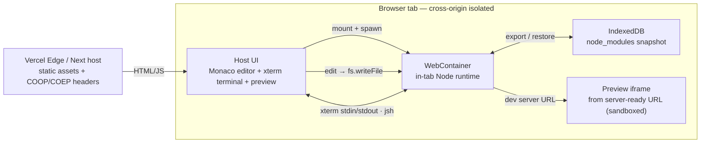

# Architecture — Codecraft

An in-browser IDE. A real Vite + React dev server boots inside the browser tab
via WebContainers; the Next.js app is only the host shell that serves it under
cross-origin isolation.

## Flow

```mermaid
flowchart LR
    CDN["Vercel Edge / Next host<br/>static assets + COOP/COEP headers"]
    subgraph Browser["Browser tab — cross-origin isolated"]
        UI["Host UI<br/>Monaco editor + xterm terminal + preview"]
        WC["WebContainer<br/>in-tab Node runtime"]
        IDB["IndexedDB<br/>node_modules snapshot"]
        IFR["Preview iframe<br/>from server-ready URL (sandboxed)"]
        UI -->|mount + spawn| WC
        WC <-->|export / restore| IDB
        WC -->|dev server URL| IFR
        UI -->|edit → fs.writeFile| WC
        UI <-->|xterm stdin/stdout · jsh| WC
    end
    CDN -->|HTML/JS| UI
```

`SharedArrayBuffer` (which WebContainers need) is only available to
cross-origin-isolated documents, so the host sets `Cross-Origin-Opener-Policy:
same-origin` and `Cross-Origin-Embedder-Policy: require-corp` on every route.

## The files that matter

The playground is five source files plus a template and a security-headers module.

1. **`hooks/use-vite-webcontainer.ts`** — the engine. Boots the shared
   WebContainer, mounts the Vite + React template (or restores a cached
   snapshot), runs `npm install` (bounded by a timeout) and `npm run dev`, spawns
   an interactive `jsh` shell, wires `server-ready` to the preview URL, and
   measures every timing with `performance.now()`. Kills the dev server and shell
   on unmount.

2. **`components/playground/web-playground.tsx`** — the layout. Resizable panes
   (file-tree + editor, terminal, preview), status/timings header, reset and
   retry, and a desktop-only hint on narrow viewports. The preview iframe is
   sandboxed.

3. **`components/playground/code-editor.tsx`** — an editable Monaco editor,
   self-hosted (no CDN). A file tree switches the active file; edits are
   debounced and written into the container FS so Vite HMR reloads the preview.

4. **`components/playground/interactive-terminal.tsx`** — an xterm.js terminal
   bound to the `jsh` shell: boot/install logs stream in, keystrokes go to the
   shell's stdin.

5. **`lib/webcontainer.ts`** — a single shared WebContainer per tab
   (`WebContainer.boot()` throws if called twice), reused across navigations.

Supporting modules: `lib/snapshot-cache.ts` (IndexedDB snapshot store),
`lib/security-headers.ts` (the single source of HTTP headers),
`data/templates/vite-react.ts` (the mounted Vite + React project), and
`lib/timeout.ts` (the install timeout helper).

## Auth and data

NextAuth v5 (Google + GitHub) with a Prisma adapter over MongoDB (`auth.ts`,
`auth.config.ts`, `lib/db.ts`, `prisma/schema.prisma`). Only `/dashboard` and
`/settings` are gated (see `routes.ts` and `proxy.ts`); the landing page, the
gallery, and the playgrounds are public so the editor opens without signing in.
