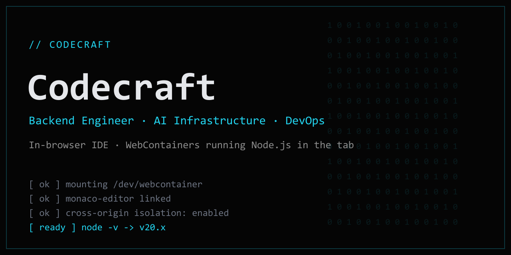
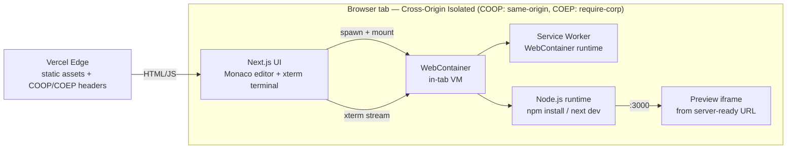

# Codecraft



**In-browser IDE. WebContainers running Node.js in the tab. Monaco + xterm bound to the WebContainer shell.**

[**Live → codecraft-ai-tau.vercel.app**](https://codecraft-ai-tau.vercel.app) · Next.js 15 · React 19 · TypeScript

---

## Demo

> 
>
> **To record `.github/demo.gif`** (≈12s, no narration needed):
> 1. Open [`/playgrounds`](https://codecraft-ai-tau.vercel.app/playgrounds)
> 2. Click **Next.js Starter**
> 3. Watch the WebContainer boot → `npm install` streams in the xterm terminal
> 4. `npm run dev` starts → terminal prints `ready`
> 5. Live preview iframe paints the running Next.js app
>
> Capture the terminal + preview side-by-side. Any screen recorder → GIF
> (e.g. ScreenToGif on Windows) at ~12 fps, 1000px wide.

What you're looking at: a real Node.js runtime booted **inside the browser tab**
via [WebContainers](https://webcontainers.io). No server, no container host — the
dev server runs on the visitor's machine, in a sandbox, isolated by COOP/COEP.

---

## What it is

- **`/` — landing.** Teerth-styled, six sections (`// IDENTIFY`, `// PLAYGROUNDS`,
  `// SHELL`, `// TECHNICAL ARSENAL`, `// LIVE TELEMETRY`, `// ESTABLISH CONNECTION`),
  a one-time ASCII boot sequence, and a live binary canvas hero.
- **`/playgrounds` — template gallery.** Four templates; **Next.js Starter** boots a
  real dev server in your tab. The other three are honest "coming soon" pages.
- **`/playground/[slug]` — the IDE surface.** WebContainer + xterm terminal + live
  preview iframe, wired end-to-end for `nextjs-starter`.
- **`/api/now` — liveness probe** returning today's date.

---

## Architecture



The **COOP/COEP isolation boundary** is the whole game: `SharedArrayBuffer` (which
WebContainers need) is only available to cross-origin-isolated documents. Codecraft
sets `Cross-Origin-Opener-Policy: same-origin` and `Cross-Origin-Embedder-Policy:
require-corp` on **every** route (`next.config.ts` + `vercel.json`), so the
WebContainer can boot on any page — including the `// SHELL` demo on the homepage.

---

## Why WebContainers?

- **vs. server-side containers** — zero infra cost and zero cold-start queue: the
  runtime is the visitor's CPU, not a pod you pay for and scale.
- **vs. iframe-only sandboxes** — those can't run `npm install` or a real Node
  process; WebContainers give you an actual POSIX-ish filesystem and process model.
- **vs. remote SSH/Codespaces** — no auth, no provisioning, no per-keystroke network
  round-trip; the dev server URL is `localhost`-fast because it *is* local.

---

## Tech stack & local dev

**Stack:** Next.js 15 (App Router) · React 19 · TypeScript · Tailwind v4 ·
`@webcontainer/api` · `@xterm/xterm` · `@monaco-editor/react` · next-themes ·
Prisma · NextAuth.

```bash
git clone https://github.com/ykstorm/codecraft-ai
cd codecraft-ai
npm install
npm run dev          # http://localhost:3000
```

`npm run build` runs `prisma generate && next build`. COOP/COEP headers are applied
in dev and prod, so WebContainers work locally too.

---

## Honest limitations

- **No native modules.** WebContainers run a WASM Node — anything needing a native
  addon won't install or run: no `fs-extra` native bits, no `sqlite3`, no
  `node-gyp`, no `sharp`, no `bcrypt`. Pure-JS deps only.
- **~30s cold boot on first visit.** First WebContainer boot + `npm install` for the
  Next.js template is slow; subsequent runs reuse the booted instance in-tab.
- **Modern browser required.** Needs `SharedArrayBuffer` + cross-origin isolation —
  current Chrome/Edge/Firefox. No mobile Safari guarantees.
- **One template is live.** `nextjs-starter` boots end-to-end; `rust-wasm`,
  `python-repl`, and `express-api` are deliberately stubbed as "coming soon" rather
  than half-working.

---

<sub>Built by [Lakshyaraj Singh Rao](https://github.com/ykstorm) · Backend Engineer · AI Infrastructure · DevOps</sub>
