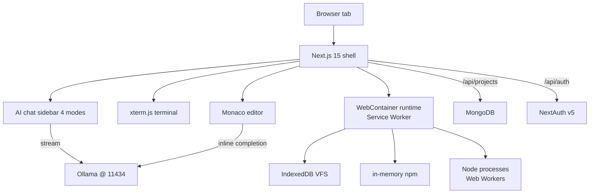

# Codecraft

**Real Node.js in your browser. Monaco + WebContainers + Ollama. OSS, self-hostable.**

[](https://github.com/ykstorm/codecraft-ai/actions/workflows/ci.yml)
[](https://github.com/ykstorm/codecraft-ai/pkgs/container/codecraft-ai)
[](LICENSE)
[](https://codecraft.lakshyaraj.dev)
[](https://github.com/ykstorm/codecraft-ai)

Live: **[codecraft.lakshyaraj.dev](https://codecraft.lakshyaraj.dev)** — sign in, open the playground, `npm install`, run a real Node process in the tab.

---

## How this started

I was writing the README for one of my other projects and wanted to test a code sample before pasting it in. The samples I had were dead — copied from my IDE, but disconnected from a runnable environment.

Normally to test a snippet I'd:
1. Open my laptop
2. `mkdir test && cd test && npm init -y`
3. `npm install express`
4. Copy the snippet into a file
5. `node server.js`
6. Move on

Twenty minutes of tooling for ten seconds of code. Every time.

StackBlitz solves this. V8 + libuv compiled to WebAssembly, running in a Service Worker. Real Node.js, inside the browser tab, no server. Brilliant. But proprietary, and you have to live with their UI choices, their auth, their pricing tier when you scale beyond hobby use.

So I built Codecraft. The OSS, self-hostable version of the same idea. Same WebContainers tech (Apache 2.0 license on theirs), my UI, my auth (NextAuth v5 with Google + GitHub), my persistence (MongoDB), my AI assistance (local Ollama).

---

## What it does

| Capability | Tech | Detail |
|---|---|---|
| **Run Node in browser** | WebContainers + Service Worker | `npm install`, `node`, processes, stdout |
| **Edit code** | Monaco editor (VS Code's editor) | Full syntax highlighting, formatting, IntelliSense |
| **Real terminal** | xterm.js + fit + search + link addons | Color, copy/paste, search, clickable URLs |
| **AI completions** | Monaco inline completions + Ollama | Trigger with Ctrl+Space |
| **4-mode AI chat** | Sidebar — Chat / Review / Fix / Optimize | All against local Ollama |
| **Persistent FS** | IndexedDB | Files survive page reload + browser restart |
| **Saved projects** | MongoDB + Prisma | Load/save named projects across devices |
| **Auth** | NextAuth v5 — Google + GitHub OAuth | JWT sessions, protected routes |
| **Docker production build** | Multi-stage, ~150 MB final | `docker compose up` and it's running |

---

## The hardest part — focus arbitration

Naive layered DOM breaks Monaco's keybindings:
- Ctrl+C in Monaco = "cancel running editor action"
- Ctrl+C in xterm = "send SIGINT to running process"
- Whichever DOM node is "on top" gets the keypress — and that's wrong half the time

I built a focus arbiter that listens for click + keydown at the document level and explicitly tags the active surface via `data-active-surface="monaco"` or `data-active-surface="xterm"`. Each surface's keymap respects that attribute. Click into the terminal → Ctrl+C goes to the process. Click into the editor → Ctrl+C is the editor's. Sounds simple. Took two days.

Documented in `docs/internals/focus-arbiter.md`. Worth reading if you ever have to mix Monaco with anything else interactive.

---

## When to use Codecraft and when not to

| You want this | Use |
|---|---|
| Self-hostable browser IDE with real Node + AI assistance | Codecraft |
| Hosted, polished, multiplayer, paid | StackBlitz, CodeSandbox, Replit |
| Remote dev VM with full Linux + IDE | GitHub Codespaces, Gitpod |
| VS Code in a browser, no Node runtime | Theia, code-server, VS Code Web |
| Notebook-style execution (Python/R focus) | Jupyter, Observable, Hex |

Codecraft is for "I want a runnable IDE in my browser tab AND I want to host it myself." The hosted options are easier; the remote options can do more. Codecraft is what you reach for when "self-hostable" is the requirement.

---

## 60-second quickstart

### Self-host with Docker

```bash
git clone https://github.com/ykstorm/codecraft-ai && cd codecraft-ai
cp .env.example .env       # add AUTH_SECRET + OAuth client IDs/secrets
docker compose up -d       # app + Ollama + MongoDB

# Wait ~30s for Ollama to pull qwen2.5-coder model
docker compose logs -f ollama

open http://localhost:3000
```

### Local dev

```bash
npm install
cp .env.example .env.local
# Make sure Ollama is running: ollama serve && ollama pull qwen2.5-coder
# Make sure MongoDB is running: docker run -d -p 27017:27017 mongo:7
npm run dev
```

For Vercel deploys, COOP/COEP/CORP headers are required for WebContainers to boot — see [DEPLOY.md](DEPLOY.md). Without those three response headers, WebContainers silently fail to register the Service Worker.

---

## What I'd build differently next time

- **Ship a hosted-AI fallback from v0.1.** Ollama is great if you have it; most people don't. v0.2 will ship an OpenAI/Anthropic fallback so users without local Ollama still get AI assistance.
- **Use Postgres instead of MongoDB.** Document storage made sense for v0.1 (project trees are document-shaped), but Postgres + JSONB is more familiar to most contributors. Prisma's data layer makes this a day's work. v0.3.
- **Multiplayer should have been v0.1.** Single-user editing feels dated. Yjs + CRDTs would make this 10x more useful. Big lift, planned for v1.0.

If you're starting now, the v0.2 hosted-AI fallback is what to expect first.

---

## Architecture



Full boot sequence + focus arbiter docs: [docs/architecture.md](docs/architecture.md).

---

## Roadmap

- [x] v0.1 — WebContainers + Monaco + xterm + Ollama + NextAuth + MongoDB + Docker
- [ ] v0.2 — hosted-AI fallback (OpenAI/Anthropic), project templates, settings UI
- [ ] v0.3 — Postgres swap (drops MongoDB), git push from inside the WebContainer
- [ ] v1.0 — multiplayer (Yjs CRDT over WebSocket)

---

## Tests + CI

```bash
npm test
npm run lint
npm run build
```

CI runs lint → typecheck → tests → docker build. Publishes image to ghcr.io on tag.

---

## Limits

- Desktop only. Mobile UI would need a different surface — not in scope for v0.x.
- WebContainers refuses to boot on `http://` — production deploy MUST be HTTPS.
- COOP/COEP/CORP headers required. Vercel, Caddy, Nginx setups in [DEPLOY.md](DEPLOY.md).
- Browser memory pressure on big `node_modules` — IndexedDB quotas vary by browser. v0.2 adds a project-size meter.

---

## License

Apache License 2.0 — see [LICENSE](LICENSE).

## Author

**Lakshyaraj Singh Rao** — Full-Stack Engineer · AI Systems · Backend · DevOps
Mumbai, India

[lakshyaraj.dev](https://lakshyaraj.dev) · [@ykstorm](https://github.com/ykstorm) · [LinkedIn](https://linkedin.com/in/lakshyaraj) · raolakshyaraj@gmail.com
