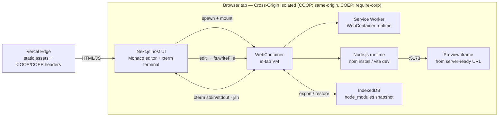

# Codecraft

**In-browser IDE. A real Vite + React dev server boots inside the tab via WebContainers — editable Monaco, an interactive xterm shell, and a hot-reloading preview.**

[**Live → codecraft-ai-tau.vercel.app**](https://codecraft-ai-tau.vercel.app) · Next.js 15 · React 19 · TypeScript

[](https://github.com/ykstorm/codecraft-ai/actions/workflows/ci.yml)
[](LICENSE)

---

## What it is

A real Node.js runtime booted **inside the browser tab** via [WebContainers](https://webcontainers.io). No server, no container host — the dev server runs on the visitor's machine, in a sandbox, isolated by COOP/COEP.

- **`/` — landing.** Sections include `// PLAYGROUNDS`, `// SHELL` (a real read-only WebContainer running `ls && node -v`), `// TECHNICAL ARSENAL`, and `// LIVE TELEMETRY` (the **measured** `webcontainer.boot()` time from your browser — no hardcoded numbers). One-time ASCII boot sequence, live binary canvas hero.
- **`/playgrounds` — template gallery.** One wired template: **Vite + React**. (More templates are added only once they boot end-to-end, rather than shipped as half-working stubs.)
- **`/playground/[slug]` — the IDE surface.** A resizable four-pane IDE: a file tree + editable **Monaco** editor, an **interactive** xterm terminal wired to a live `jsh` shell, and a hot-reloading **preview** iframe served from the WebContainer's `server-ready` URL. Edits debounce-write into the container FS so Vite HMR refreshes the preview in <2s. On a narrow viewport it shows a clean desktop-only hint instead of a cramped boot.
- **`/api/now` — liveness probe** returning today's date.

Landing (`/`), the gallery (`/playgrounds`), and the playgrounds (`/playground/*`) are deliberately **public** — a recruiter can open the editor without signing in. `/dashboard` and `/settings` are gated by NextAuth. See [`routes.ts`](routes.ts).

---

## Architecture



The **COOP/COEP isolation boundary** is the whole game: `SharedArrayBuffer` (which WebContainers need) is only available to cross-origin-isolated documents. Codecraft sets `Cross-Origin-Opener-Policy: same-origin` and `Cross-Origin-Embedder-Policy: require-corp` on **every** route (`next.config.ts` + `vercel.json`), so the WebContainer can boot on any page — including the `// SHELL` demo on the homepage.

---

## Why WebContainers?

- **vs. server-side containers** — zero infra cost and zero cold-start queue: the runtime is the visitor's CPU, not a pod you pay for and scale.
- **vs. iframe-only sandboxes** — those can't run `npm install` or a real Node process; WebContainers give you an actual POSIX-ish filesystem and process model.
- **vs. remote SSH/Codespaces** — no auth, no provisioning, no per-keystroke network round-trip; the dev server URL is `localhost`-fast because it *is* local.

---

## Tech stack & local dev

**Stack:** Next.js 15 (App Router, the host app) · React 19 · TypeScript · Tailwind v4 · `@webcontainer/api` · `@xterm/xterm` + `@xterm/addon-fit` · `@monaco-editor/react` · `react-resizable-panels` · next-themes · Prisma · NextAuth. The **playground template** booted inside the WebContainer is Vite + React 18.

```bash
git clone https://github.com/ykstorm/codecraft-ai
cd codecraft-ai
npm install
cp .env.example .env   # see "Environment" below
npm run dev            # http://localhost:3000
```

Then open **http://localhost:3000/playground/vite-react-starter** — the landing page and playground are public, so no sign-in is needed to reach the editor.

`npm run build` runs `prisma generate && next build`. COOP/COEP headers are applied in dev and prod (`next.config.ts` + `vercel.json`), so WebContainers work locally too.

### Environment

The landing page and playground need **no** secrets to run. The auth-gated `/dashboard` and `/settings` and the NextAuth callbacks need these (validated lazily in [`lib/env-validate.ts`](lib/env-validate.ts)):

| Variable | Required for | Notes |
|---|---|---|
| `AUTH_SECRET` | NextAuth sessions | `openssl rand -base64 32` |
| `AUTH_GITHUB_ID` / `AUTH_GITHUB_SECRET` | GitHub sign-in | GitHub OAuth app |
| `AUTH_GOOGLE_ID` / `AUTH_GOOGLE_SECRET` | Google sign-in | Google OAuth client |
| `DATABASE_URL` | Prisma (users/accounts) | any Prisma-supported DB |
| `OLLAMA_BASE_URL` | `/api/code-completion`, `/api/chat` | optional; defaults to the docker-compose service |

---

## Honest limitations

- **No native modules.** WebContainers run a WASM Node — anything needing a native addon won't install or run: no `sqlite3`, no `node-gyp`, no `sharp`, no `bcrypt`. Pure-JS deps only.
- **30-90s cold boot on first visit.** First WebContainer boot + `npm install` for the Vite template runs in your tab. On return visits the container exports its filesystem (including `node_modules`) to an IndexedDB snapshot and re-mounts it, dropping the boot to **under 20s**. Use the in-playground **reset** button to wipe the snapshot and reinstall from the pristine template.
- **Edits don't persist across a hard refresh.** A full reload re-mounts the snapshot (or the template). The editor writes live into the container FS for HMR, not to durable storage.
- **Modern desktop browser required.** Needs `SharedArrayBuffer` + cross-origin isolation — current Chrome/Edge/Firefox. Narrow viewports get a desktop-only hint instead of a broken boot.
- **One template is live.** `vite-react-starter` boots end-to-end. More templates ship only when they boot end-to-end.

> **Note on verification:** the live WebContainer boot can only be exercised in a real cross-origin-isolated browser. CI verifies install, `prisma generate`, typecheck, lint, `next build`, and unit tests; the in-tab boot/edit/terminal is verified on the Vercel preview. See [`docs/CLAIM_AUDIT.md`](docs/CLAIM_AUDIT.md).

---

## License

Apache 2.0 — see [LICENSE](LICENSE).
