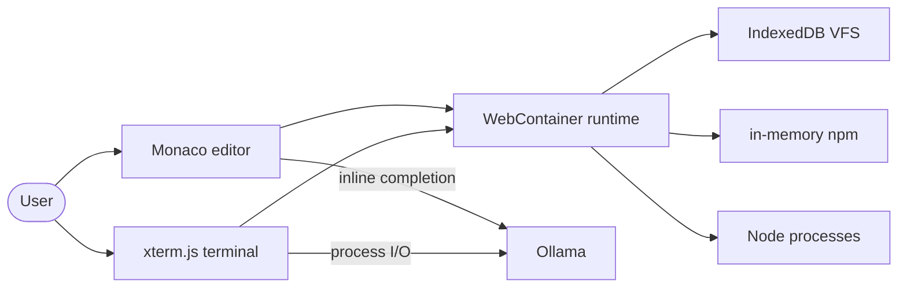

# Codecraft

**In-browser IDE — WebContainers + Monaco + AI completions. Building.**

[](https://github.com/ykstorm/codecraft-ai/actions/workflows/ci.yml)
[](LICENSE)

## Status

> 🚧 **Active build.** Landing + auth shell are live at [codecraft-ai.vercel.app](https://codecraft-ai.vercel.app).
> The IDE workspace (`/playground/[id]`) is scaffolded but the supporting modules
> (file tree, terminal, AI assist) are in active development.
> See [ROADMAP.md](ROADMAP.md) for the build plan.

## What this is

A self-hostable in-browser IDE: Monaco editor, real Node.js via WebContainers, local
Ollama for AI completions, xterm.js terminal. For when "self-hostable browser IDE" is
the hard requirement.

## Architecture



## What's NOT here

- **WebContainer integration module** — in development
- **Terminal pane (xterm)** — in development
- **AI completions (monacopilot)** — in development
- **Project persistence layer** — in development
- Requires Ollama installed locally (no cloud fallback)

## Try locally

```bash
git clone https://github.com/ykstorm/codecraft-ai && cd codecraft-ai
npm install
cp .env.example .env.local
# Start Ollama: ollama serve && ollama pull qwen2.5-coder
# Start MongoDB: docker run -d -p 27017:27017 mongo:7
npm run dev
```

## Stack

| Layer | Choice |
|---|---|
| Framework | Next.js 15 |
| Editor | Monaco (VS Code) |
| Runtime | @webcontainer/api |
| Terminal | xterm.js |
| AI | Ollama (local) |
| Auth | NextAuth v5 (Google + GitHub) |
| DB | MongoDB + Prisma |
| Deployment | Docker + Vercel |

## License

Apache 2.0 — see [LICENSE](LICENSE).