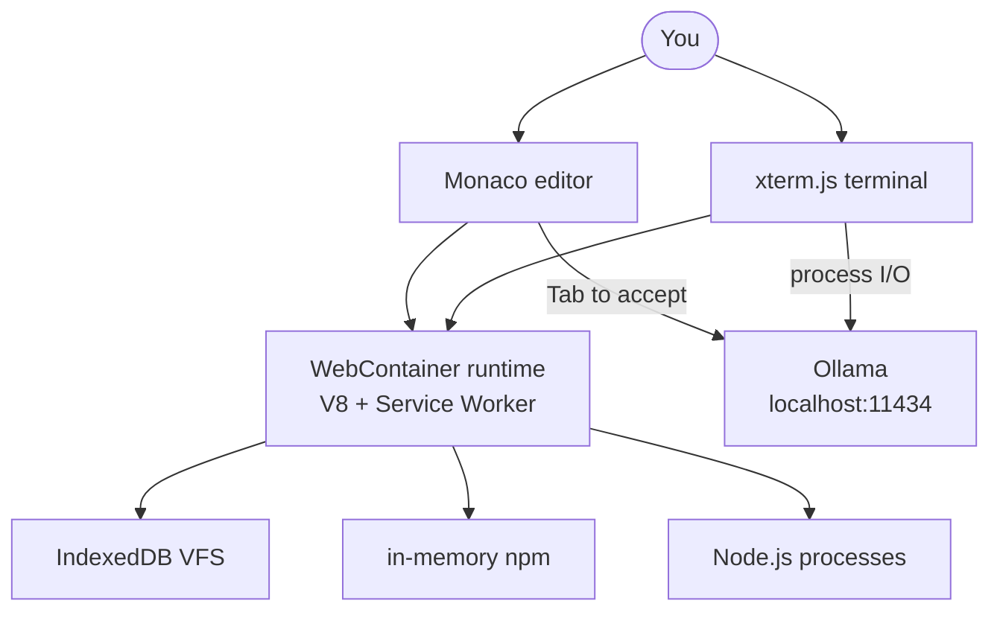

# Codecraft

**In-browser IDE — real Node.js via WebContainers, Monaco editor, local Ollama for AI.**

[](https://github.com/ykstorm/codecraft-ai/actions/workflows/ci.yml)
[](LICENSE)

## The problem

Remote code execution (Codespaces, code-server) means latency per keystroke and cost per container-hour. Emulators can't handle `npm install` + real Node.js. I needed a browser IDE that runs code without a server and without an emulator — WebContainers are the answer.

## What it does

Monaco editor + xterm.js terminal running real Node.js in a browser tab via WebContainers (V8 in a Service Worker). Local Ollama handles AI completions — no API key needed, no network latency. Sign in with Google or GitHub; projects stored in MongoDB via Prisma.

[Live at codecraft-ai.vercel.app](https://codecraft-ai.vercel.app)

## How it works



Key flows:
- **Edit** → Monaco highlights syntax, AI suggestion appears inline (Tab to accept, Esc to dismiss)
- **Run** → xterm.js connects to WebContainer shell — `node`, `npm install`, anything Node supports
- **AI chat** → sidebar with 4 modes: chat / review / fix / optimize, routes to Ollama
- **Project** → create/edit/delete/star projects, persisted in MongoDB

If Ollama isn't running, completions return `"// AI suggestion unavailable"` — editor keeps working without AI.

## Stack

| Layer | Choice |
|---|---|
| Framework | Next.js 15 |
| Editor | Monaco (VS Code) |
| Runtime | @webcontainer/api |
| Terminal | xterm.js |
| AI | Ollama (local, no API key) |
| Auth | NextAuth v5 (Google + GitHub) |
| DB | MongoDB + Prisma |
| Deployment | Docker + Vercel |

## What's NOT here

- **Collaborative editing** — single-user, no multiplayer
- **File persistence** — IndexedDB resets on tab close; no save-to-cloud layer yet
- **Non-Chromium browsers** — WebContainers require Chrome/Edge/Brave; Firefox/Safari show a polite error
- **Mobile/tablet** — desktop browser only
- **Cloud WebContainers** — architecturally impossible; runs client-side

## Try locally

```bash
git clone https://github.com/ykstorm/codecraft-ai && cd codecraft-ai
npm install
cp .env.example .env.local

# Terminal 1: Ollama
ollama serve && ollama pull codellama:latest

# Terminal 2: MongoDB
docker run -d -p 27017:27017 mongo:7

# Terminal 3: dev server
npm run dev
# Open http://localhost:3000
```

## License

Apache 2.0 — see [LICENSE](LICENSE).