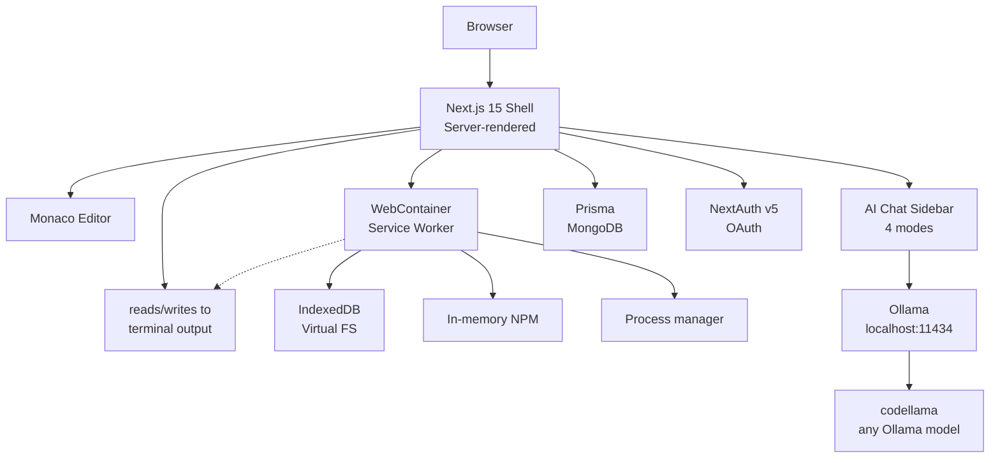

# codecraft-ai — Browser-Based AI IDE

[](https://github.com/ykstorm/codecraft-ai/actions/workflows/ci.yml)
[](https://github.com/ykstorm/codecraft-ai/pkgs/container/codecraft-ai)
[](LICENSE)

---

## I built this because I wanted a real IDE in my browser

Not a code editor with limited features. Not a remote server that adds latency. A actual IDE — the kind where you can `npm install`, hit `node server.js`, and watch it run, all inside a browser tab with zero server-side compute.

The browser-as-runtime idea fascinated me. WebContainers let you run V8 (the same engine Node.js uses) directly in a Service Worker in the browser. That's wild. So I built around that.

**Stack:** Next.js 15 · Monaco Editor · WebContainers · xterm.js · Ollama · NextAuth v5 · MongoDB · Docker

---

## Quick start

```bash
git clone https://github.com/ykstorm/codecraft-ai && cd codecraft-ai
cp .env.example .env          # add AUTH_SECRET, OAuth credentials
docker compose up -d          # app + Ollama + MongoDB
# visit http://localhost:3000
```

Or local dev (you'll need Ollama running separately):

```bash
npm install
cp .env.example .env.local
npm run dev
```

---

## What it does

### The browser runtime

WebContainers boot a full Node.js environment inside a Service Worker. The virtual file system is backed by IndexedDB — files survive page reloads, container restarts don't wipe state. No server storage needed for user code. You get `npm install`, `node` processes, stdout/stderr — all client-side.

### Monaco Editor + AI autocomplete

Monaco is the editing surface with syntax highlighting, formatting, keybindings. The AI suggestion system hooks into Monaco's inline completions API — trigger with `Ctrl+Space` or double-Enter. Suggestions come from Ollama running locally.

### 4-mode AI chat

The sidebar has four modes:
- **Chat** — general questions, architecture advice, debugging help
- **Review** — paste code, get a structured review
- **Fix** — paste buggy code, get a corrected version with explanation
- **Optimize** — paste code, get a performance-improved version

All four hit Ollama (running locally at `http://localhost:11434`). If Ollama isn't available, the app logs a warning and continues without AI — the chat UI just won't respond.

### xterm.js terminal

Interactive terminal emulator with fit addon, search, and web link detection. Monaco and xterm share the terminal surface via layered DOM — xterm handles raw keyboard input, Monaco only activates when you're editing a file.

### Auth

NextAuth v5 with Google and GitHub OAuth. Protected routes redirect to sign-in. JWT sessions. No "demo auth" — this is production-grade.

---

## Architecture



The key thing: everything under "WebContainer" runs in the browser. Vercel only serves the static shell. Ollama runs on the same machine as the user (localhost), so AI inference is free and instantaneous.

---

## The tricky part — WebContainer + Monaco integration

The hardest part wasn't WebContainer itself — it's getting Monaco and xterm to coexist on the same surface. Monaco never gets direct keyboard access to the terminal pane. xterm handles raw terminal input. Monaco only activates when the cursor is in the editor.

I used a layered DOM approach: xterm's terminal element sits behind Monaco's editor in z-order. When the user is in the editor, Monaco captures keystrokes. When the user clicks the terminal, a flag switches and xterm takes over. The Monaco inline completion provider checks cursor position before showing suggestions.

---

## Tests

```bash
npm test         # 23 tests: env-validate (8), ratelimit (7), utils (8)
npm run build    # prisma generate + next build
npm run lint      # ESLint
```

CI runs: lint → prisma generate → test → build. Every PR, every push.

---

## Environment variables

```env
DATABASE_URL="mongodb://localhost:27017/chai-vibe"   # MongoDB connection
AUTH_SECRET="..."                                    # NextAuth secret (min 32 chars)
AUTH_GITHUB_ID="..."                                 # GitHub OAuth app client ID
AUTH_GITHUB_SECRET="..."
AUTH_GOOGLE_ID="..."                                 # Google OAuth app client ID
AUTH_GOOGLE_SECRET="..."
OLLAMA_BASE_URL="http://localhost:11434"             # Ollama endpoint
```

Ollama connectivity issues are warnings — the app starts without AI features if Ollama isn't available.

---

## Deployment

- **Vercel** — Next.js static shell (no server-side code execution)
- **GitHub Container Registry** — Docker image for self-hosting
- **`/api/health`** — `GET /api/health` returns `{ status: "ok", timestamp }` for load balancer checks
- **Rate limiting** — 20 requests/minute per IP (sliding window, in-memory with Upstash Redis option)

---

## What this project proves

For a founding-engineer / senior IC role, this shows I can:

- Build complex client-side architecture (WebContainers aren't trivial)
- Integrate multiple APIs (Monaco, xterm, Ollama, NextAuth, Prisma)
- Handle async initialization patterns (WebContainer.boot → mount → spawn)
- Write production-grade TypeScript with strict mode
- Design Docker Compose stacks for local development
- Set up CI/CD with GitHub Actions

---

## License

Licensed under the Apache License 2.0 — see [LICENSE](LICENSE).

## About

**Lakshyaraj Singh Rao** — Founding Engineer · AI Systems · Full-Stack · Jaipur → Bangalore + Mumbai + Remote

Portfolio: lakshyaraj.dev (coming) · GitHub: [@ykstorm](https://github.com/ykstorm) · LinkedIn: [/in/lakshyaraj](https://linkedin.com/in/lakshyaraj) · Email: raolakshyaraj@gmail.com