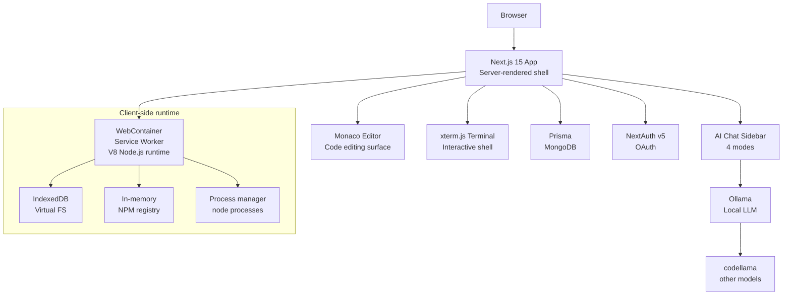

# SPEC.md — CodeCraft AI

> 1-page summary. Verify every claim against actual code before committing.

---

## What it is

**CodeCraft AI** (UI name: "Chai Vibe Editor") is a browser-based IDE that runs real Node.js workloads client-side — no server-side compute for code execution. Built with Next.js 15, Monaco Editor, WebContainers, xterm.js, and Ollama for local AI assistance.

---

## Problem it solves

Browser-based IDEs traditionally either run code on remote servers (slow, expensive) or use limited emulators that can't handle real `npm install` + `node` workflows. CodeCraft eliminates the server entirely — the browser tab becomes the runtime via WebContainers (V8 Service Worker).

---

## Core features (verified in code)

| Feature | Location |
|---|---|
| Monaco Editor with AI inline completions (`Ctrl+Space` / double-Enter) | `modules/playground/components/playground-editor.tsx` |
| WebContainer boot + file system mount + npm install + node | `modules/webcontainers/hooks/useWebContainer.ts` |
| xterm.js terminal with fit + search + web links addons | `modules/webcontainers/components/terminal.tsx` |
| 4-mode AI chat (chat/review/fix/optimize) via Ollama | `modules/ai-chat/components/` + `app/api/chat/route.ts` |
| NextAuth v5 with Google + GitHub OAuth | `auth.ts`, `middleware.ts` |
| Prisma + MongoDB for project/user data persistence | `lib/db.ts` |
| Per-IP rate limiting (20 req/min sliding window) | `lib/ratelimit.ts` |
| Environment validation on startup | `lib/env-validate.ts` |
| Health endpoint `/api/health` | `src/app/api/health/route.ts` |
| Docker Compose: app + ollama + mongodb | `docker-compose.yml` |

---

## Architecture

---

## Key design decisions

1. **WebContainers over server-side execution** — Zero server cost for code execution. Tradeoff: ~10MB runtime download on first load, cached thereafter. Users need Ollama installed locally for AI features.

2. **Ollama over external APIs** — Zero API costs, no latency to external services, code never leaves the browser. Fallback chain: Ollama → error logged as warning → app continues without AI.

3. **Next.js App Router shell** — Server-side rendering gives fast initial load. WebContainer and Monaco load async after shell is painted. WebContainer is the "app" inside the shell.

4. **4-mode AI with mode-specific prompts** — Chat, Review, Fix, Optimize each have distinct system prompts. Single Ollama endpoint handles all modes. Sliding window rate limit (20 req/min) protects the local LLM.

5. **Docker Compose for full local stack** — `docker compose up` brings app + Ollama (GPU) + MongoDB. Production: Vercel (static shell) + Ollama/MongoDB as separate self-hosted or cloud services.

---

## Tech stack (verified from package.json)

- Next.js 15.5.18 (Turbopack), React 19.1.0, TypeScript strict
- Tailwind v4, ShadCN UI, Radix UI
- Monaco Editor (@monacopilot), xterm.js addons
- WebContainers (@webcontainer/api 1.6.1)
- Ollama (local), NextAuth v5 beta
- Prisma 6.13 + MongoDB
- Upstash rate limiting
- Docker, Docker Compose, GitHub Actions

---

## Test coverage

- 23 tests passing (env-validate: 8, ratelimit: 7, utils: 8)
- CI: lint → prisma generate → test
- No test coverage for AI chat routes or WebContainer integration

---

## Gaps identified

- No pre-commit hooks
- `src/lib/env-validate.ts` has unused `OPTIONAL_ENV_VARS` variable
- `app/(root)/page.tsx` has unused `cn` import
- `components/ui/theme-toggle.tsx` has unused `SunMoon` import
- No ARCHITECTURE.md or polished INTERVIEW_REPORT.md in place

---

## Licensing

- LICENSE exists (MIT)
- npm package: `codecraft-ai` (published to npm)
- GitHub topics need updating: add `browser-ide`, `webcontainers`, `ollama`, `monaco-editor`, `nextjs`, `typescript`